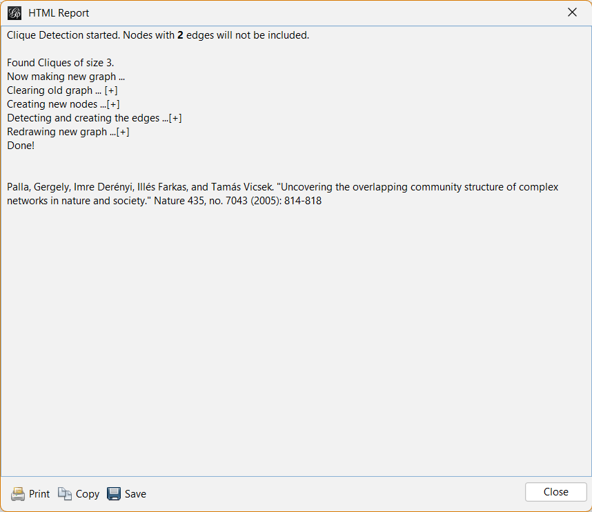
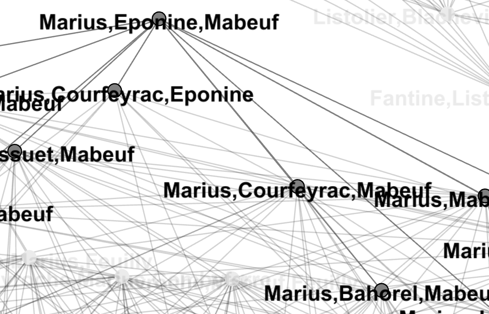
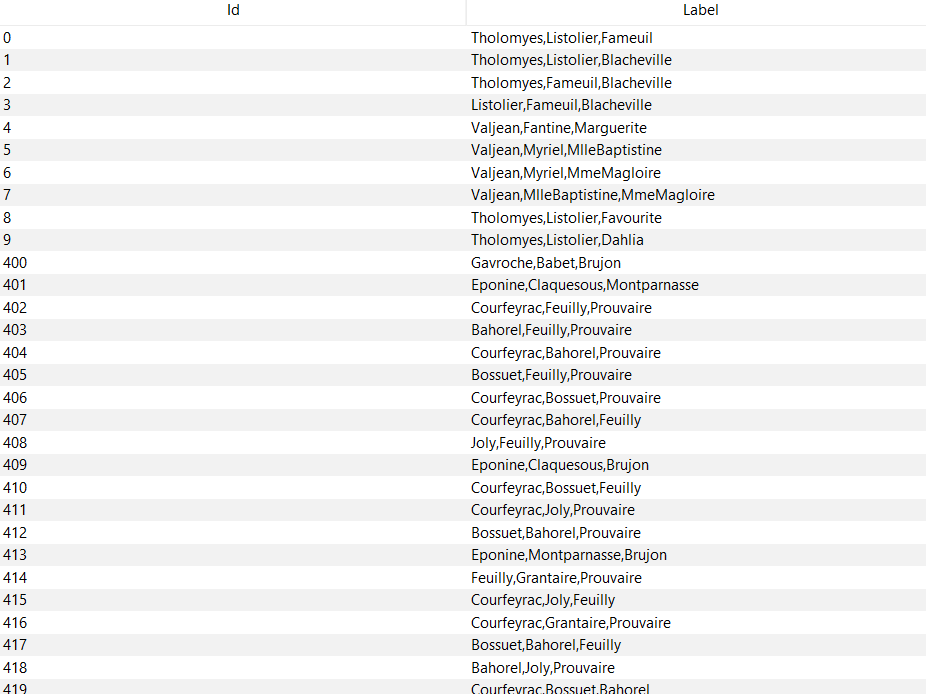

# Clique Percolation Method

The **Clique Percolation Method (CPM)** is a Gephi plugin designed for finding overlapping communities in networks. This method detects communities of size *k* and constructs a clique graph based on cliques of the same size. The plugin transforms the original graph into a clique graph with *k* nodes.

## Algorithm

The algorithm is straightforward:

1. Find all cliques of size *k* in the graph.
2. Create a new graph where nodes represent cliques of size *k*.
3. Add edges between nodes (cliques) that share *k-1* common nodes.
4. Each connected component in this graph represents a community.

## History

I developed this plugin during my PhD studies at [Urmia University](https://urmia.ac.ir) in the field of IT. While working on community detection, I realized that there was no existing Gephi plugin to visualize overlapping communities. Consequently, I created this plugin for Gephi.

Initially, the plugin was compatible with Gephi version 0.8.2. However, my student, [Ebrahim Shami](https://github.com/qfewzz), updated it for Gephi 10.0 as part of the Complex Networks course at Urmia University.

```shell
$ whoami
mirsamantajbakhsh
```

I currently serve as an Assistant Professor in Computer Engineering at Urmia University. My research interests include Social Network Analysis, Big Data Mining, NLP, and, outside academia, playing the guitar, enjoying nature, and exploring Android development. You can find more about me on [my website](https://mstajbakhsh.ir).

## Sample Run

I tested this plugin using the "Les Misérables" sample graph in Gephi.



The HTML report:

```html
Clique Detection started. Nodes with <b>2</b> edges will not be included.

Found Cliques of size 3.
Now creating a new graph...
Clearing the old graph... [✔]
Creating new nodes... [✔]
Detecting and creating edges... [✔]
Redrawing the new graph... [✔]
Done!

Reference:
Palla, Gergely, Imre Derényi, Illés Farkas, and Tamás Vicsek. "Uncovering the overlapping community structure of complex networks in nature and society." Nature 435, no. 7043 (2005): 814-818
```

And here is the output graph:


Zoomed view:


Data records:


## Download

You can find the latest version of the plugin on the [RELEASE](https://github.com/mirsamantajbakhsh/CliquePercolationMethod/releases/tag/Main) page.

## Reference

Palla, Gergely, Imre Derényi, Illés Farkas, and Tamás Vicsek. "Uncovering the overlapping community structure of complex networks in nature and society." Nature 435, no. 7043 (2005): 814-818.
: [Gephi Plugins Repository](https://github.com/gephi/gephi-plugins)
: [Gephi Plugin Development Guidelines](https://github.com/gephi/gephi-plugins)
: [nbm-maven-plugin Documentation](https://github.com/apache/netbeans-tools/tree/master/nbm-maven-plugin)
: [Gephi](https://gephi.org)
: [Urmia University](https://urmia.ac.ir)